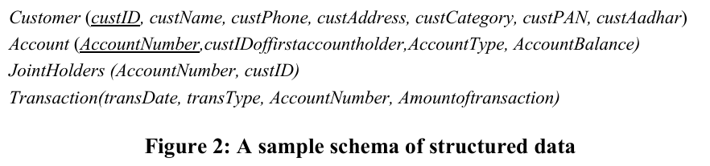
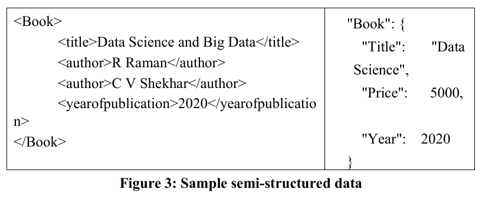
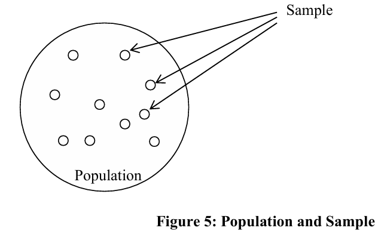
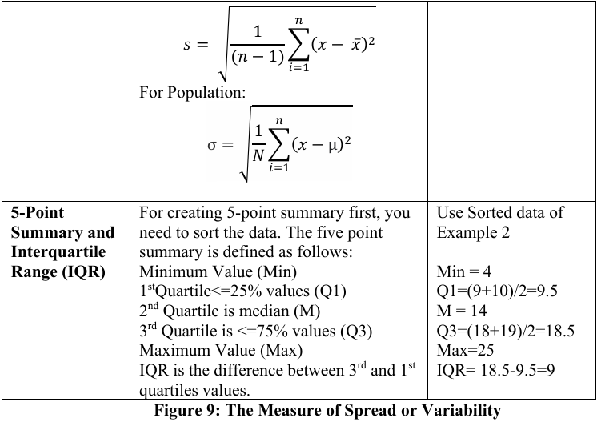

# UNIT 1  INTRODUCTION TO DATA SCIENCE

---

1.0 Introduction  

1.1 Objective  

1.2 Data Science – Definition  

1.3 Types of Data  

&nbsp;&nbsp;&nbsp;&nbsp;1.3.1 Statistical Data Types  

&nbsp;&nbsp;&nbsp;&nbsp;1.3.2 Sampling  

1.4 Basic Methods of Data Analysis  

&nbsp;&nbsp;&nbsp;&nbsp;1.4.1 Descriptive Analysis  

&nbsp;&nbsp;&nbsp;&nbsp;1.4.2 Exploratory Analysis  

&nbsp;&nbsp;&nbsp;&nbsp;1.4.3 Inferential Analysis  

&nbsp;&nbsp;&nbsp;&nbsp;1.4.4 Predictive Analysis  

1.5 Common Misconceptions of Data Analysis  

1.6 Applications of Data Science  

1.7 Data Science Life Cycle  

1.8 Summary  

1.9 Solutions / Answers  

---
## 1.0 INTRODUCTION
---

In the last ten years, the Internet and communication technology have grown very fast. Because of this growth, a huge amount of data is being created every day.

Most of this data is **unstructured**, which means it does not have a fixed format. Examples of unstructured data are:

* Text from social media posts
* Images and graphics
* Videos
* Audio files

This data is mainly generated because people use social media, smartphones, and mobile apps a lot.

Along with this, organisations are also growing digitally. Because of this digital growth, a large amount of **semi-structured data** is being created. An example of semi-structured data is **XML data**. This type of data is partly organized but not completely like tables.

In addition to unstructured and semi-structured data, organisations already have a large amount of **structured data** stored in databases and data warehouses.

All these types of data can be processed, sometimes in **real time**, to help organisations make better decisions.

**Data science** is a field that focuses on:

* Collecting data
* Combining data from different sources
* Processing large amounts of data

The main goal of data science is to produce useful information that helps in **better and informed decision making**.

This unit introduces the basic concepts of data science. It explains different types of data used in data science and the different types of analysis that can be done using data. The unit also introduces some common mistakes that people make while working with data science.

---
## 1.1 OBJECTIVES
---

At the end of this unit, you will be able to:

- Define what **data science** means in the context of an organization  
  (for example, how companies use data to support business decisions)

- Explain the **different types of data** used in data science  

- List and explain the **different types of analysis** that can be performed on data  

- Explain the **common mistakes related to data size**  
  (for example, believing that more data always gives better results)

- Define the concept of **data dredging**  
  (searching for patterns in data without a proper goal)

- List some **applications of data science**  
  (for example, healthcare, finance, and marketing)

- Define the **data science life cycle**  
  (the steps followed from collecting data to getting results)

---
## 1.2 DATA SCIENCE – DEFINITION
---

Data Science is a **multi-disciplinary field** whose main goal is to analyze data and generate useful knowledge that can help in decision making.

The knowledge produced by data science can be in different forms, such as:
- Finding similar patterns in data  
- Building predictive or planning models  
- Creating forecasting models for future outcomes  
  (for example, predicting future sales or customer demand)

A data science application collects data from **multiple heterogeneous sources**, meaning data comes from different types of sources and formats. This data is then:
- Cleaned to remove errors and unwanted data  
- Integrated to combine data from different sources  
- Processed and analyzed using various tools  

After analysis, the results are presented as **information and knowledge** using different visual forms such as charts and graphs  
(for example, dashboards used by companies to understand performance).

As mentioned earlier, data science is called a **multi-disciplinary science** because it combines knowledge from different fields, as shown in Figure 1.

## Advantages of Data Science in an Organization

Data science has many advantages in an organization. Some important areas where data science is useful are given below:

- It helps organizations make **better business decisions**, such as checking the financial health and reliability of companies before collaborating with them.

- It helps in making **better future predictions**, such as creating strategic plans for the company based on current data and trends.

- It helps identify **similar patterns in data**, which can be used in applications like fraud detection and targeted marketing.

In general, data science plays an important role in **business decision making**, especially in today’s world where data is being generated at a very large scale, measured in zettabytes.

## Applications of Data Science

Data science can be used in many organizations. Some important uses of data science are given below:

- It can be used to find the **best and fastest route** from a source to a destination. Such applications continuously monitor traffic conditions and predict the best route using collected data.

- It can help reduce **logistics and transportation costs** by suggesting the best time and route for transporting goods.

- It can reduce **marketing expenses** by identifying similar buying patterns among customers and performing targeted or selective advertising based on data.

- It can help in creating **public health policies**, especially during emergency or disaster situations.

- It can be used to study the **environmental impact** of different development activities.

- It can help in **saving resources** in smart cities by using data to improve planning and management.

---
## 1.3 TYPES OF DATA
---

The type of data is an important factor because it decides what kind of analysis should be performed on the data. In data science, the following types of data are commonly processed:

1. Structured Data  
2. Semi-Structured Data  
3. Unstructured Data  
4. Data Streams  

***Structured Data***

Since the beginning of the computing era, computers have been used to process data. However, it was only after the 1960s that businesses started using computers widely for data processing.

During that time, one of the popular programming languages was **Common Business-Oriented Language (COBOL)**. COBOL included a data division that defined the structure of the data being processed.

Later, a major technological change was introduced by **E. F. Codd**, which led to the development of **Relational Database Management Systems (RDBMS)**. RDBMS allows data to be stored, retrieved, and processed in a structured way. This data can be securely shared among multiple applications within an organization.

RDBMS technology also supports secure transactions, which made it a major source of data generation for organizations. Figure 2 shows an example of how data is structured in a relational database system.

One key characteristic of structured data is that it follows a **schema**, which means the data has a fixed structure. Each part of the schema is linked to a specific data type.

Relational data is a form of **structured data**, and a large amount of this data is collected by organizations as the backend for most applications.

In the 1990s, the concept of a **data warehouse** was introduced. A data warehouse is a collection of organizational data that is:
- Time-invariant, meaning data is stored over a long period
- Subject-oriented, meaning data is organized around specific topics
- Used mainly for decision making

Data in a data warehouse is stored using **fact tables** and **dimension tables**. Fact tables store the main data, while dimension tables describe and classify the data in the fact tables. The data warehouse data is structured and is mainly used for analytical processing and data mining.

Over time, many different types of database management systems were developed, and most of them store structured data.

However, with the rapid growth of communication and mobile technologies, many new applications became popular. As a result, a very large amount of **semi-structured** and **unstructured** data started getting generated. These types of data are discussed next.

***Semi-Structured Data***

As the name suggests, semi-structured data has **some level of structure**, but it is not completely organized like structured data. The structure in semi-structured data comes from the use of **tags** or **key–value pairs**.

Common examples of semi-structured data include:
- XML data  
- JSON objects  
- Server logs  
- EDI data  

Figure 3 shows an example of semi-structured data.

***Unstructured Data***

Unstructured data does not follow any fixed schema or structure. For example, written text such as the content of this unit is unstructured data. Sometimes, headings or metadata can be added to unstructured data, but the data itself does not have a defined structure.

The growth of the Internet has led to the generation of **zettabytes of unstructured data**. Some examples of unstructured data are:

- Large amounts of written text such as emails and social media data  
- Unprocessed audio and video data  
- Image data and mobile data  
- Unprocessed natural speech data  
- Unprocessed geographical data  

In general, unstructured data requires very large storage space, new processing methods, and high-speed processing capabilities.

***Data Streams***

A data stream is a sequence of data generated continuously over a period of time. Data streams can be structured, semi-structured, or unstructured, but they are generated repeatedly.

For example, IoT devices such as weather sensors generate continuous data streams of temperature, pressure, wind speed, wind direction, and humidity for a specific location.

Such data is very large and, in many applications, needs to be processed in **real time**. Usually, not all data from streams is stored permanently; instead, it is processed for a specific period of time based on the requirement.

### 1.3.1 Statistical Data Types

There are two main types of data used in statistical analysis:
- Categorical data  
- Quantitative data  

***Categorical (Qualitative) Data***

Categorical data is used to represent **categories or groups**. For example, the occupation of a person can belong to categories such as “Business”, “Salaried”, or “Others”.

Categorical data is measured using two types of scales:

- **Nominal scale**  
  If the categories do not have any relationship or order, the data is called nominal data.  
  For example, the categories “Business” and “Salaried” do not have any order or ranking, so this data is nominal.

- **Ordinal scale**  
  If the categories have a meaningful order or relationship, the data is called ordinal data.  
  For example, age categories such as “0 to less than 26”, “26 to less than 46”, “46 to less than 61”, and “More than 61” have a clear order. A person in the “More than 61” category is older than people in the other categories.

***Quantitative Data***

Quantitative data is **numerical data** and is used to represent measurable quantities. This type of data is divided into two types:

- **Discrete data**  
  Represents countable numbers such as 2, 3, 5, and so on  
  (for example, number of students in a class)

- **Continuous data**  
  Represents values that can take any value within a range  
  (for example, height of a person measured on a continuous scale)

***Measurement Scale of Data***

Data refers to raw facts. For example, student data may include name, gender, age, and height.

The name of a student is used to uniquely identify a person, similar to a primary key in a database. However, identifying data like name is usually not useful for data analysis.

Data such as gender, age, and height can be used to answer analytical questions like:  
Is there a difference in the height of boys and girls in the age group of 10–15 years?

An important question in data analysis is how data should be measured so that it is recorded consistently. Stanley Stevens, a psychologist, defined four characteristics of measurement scales that can be used to measure data.

- Each value used to represent a measurement should be **unique**. This property is called the **identity of a value (IDV)**.

- The second characteristic is **magnitude (M)**, which allows values to be compared. For example, a weight of 70.5 kg is greater than 70.2 kg.

- The third characteristic is **equality of intervals (EI)**, which means the difference between values is consistent. For example, the difference between 25 and 30 is 5 units, which is the same as the difference between 41 and 46, also 5 units.

- The final characteristic is the presence of a **defined minimum or zero value (MZV)**. For example, temperature measured on the Kelvin scale has an absolute zero value, whereas intelligence quotient does not have a true zero value.

Based on these characteristics, four basic types of measurement scales are defined. Figure 4 shows these measurement scales along with their characteristics and examples.

Figure 4 explains the **four measurement scales of data** based on four characteristics:
- IDV (Identity of Value)
- M (Magnitude)
- EI (Equality of Intervals)
- MZV (Minimum or Zero Value)

*Nominal Scale*
- This scale only identifies data.
- It has **identity (IDV)** but no magnitude, equal intervals, or true zero.
- Values cannot be compared or ordered.
- Example: Gender  
  (F – Female, M – Male)

*Ordinal Scale*
- This scale identifies data and allows **ranking or ordering**.
- It has identity and magnitude (only for ranking), but no equal intervals and no true zero.
- The order matters, but the difference between ranks is not equal.
- Example: Age or income categories such as  
  “0 or more but less than 26”,  
  “26 or more but less than 46”,  
  “46 or more but less than 61”,  
  “More than 61”

*Interval Scale*
- This scale has identity, magnitude, and **equal intervals**.
- It does not have a true zero value.
- Differences between values are meaningful, but ratios are not.
- Example: IQ, temperature measured in Celsius

*Ratio Scale*
- This scale has all four characteristics: identity, magnitude, equal intervals, and a **true zero value**.
- It allows comparison, ordering, difference, and ratio operations.
- Example: Temperature in Kelvin, age

### 1.3.2 Sampling

In general, the size of data that needs to be processed today is very large. This raises an important question: should the entire dataset be used, or should only a representative sample of the data be used?

In many data science techniques, **sample data** is used to build exploratory models. Using a sample helps increase the **speed of exploratory data analysis**, especially when working with very large datasets.

In this context, the **population** refers to the complete set of data that is of interest. A **sample** is a smaller part selected from this population. Figure 5 shows the relationship between population and sample.

An important question in sampling is deciding the **appropriate sample size**. The exact size can be determined by referring to existing studies and literature. However, the key point is that a good sample should be **representative of the population**, meaning it should reflect the main characteristics of the entire dataset.

Figure 5 shows the relationship between a **population** and a **sample**.

The large circle represents the **population**, which means the complete set of data that is of interest. Each small dot inside the circle represents an individual data item in the population.

The arrows pointing to a few selected dots represent the **sample**. A sample is a smaller subset chosen from the population.

The figure explains that instead of using the entire population for analysis, a **representative sample** can be selected. This sample should reflect the main characteristics of the population so that correct conclusions can be drawn while reducing processing time and effort.

One of the main objectives of statistics is to use **sample data** to calculate statistics and then estimate how accurately these statistics represent the **population parameters**.

In statistics, values calculated from a sample are used to predict the characteristics of the population with a certain level of accuracy. The terms used in this context are explained in the table below.

| Term       | Used for | Example |
|-----------|----------|---------|
| Statistic | Calculated from the **sample** | Sample mean (x̄), sample standard deviation (s), sample size (n) |
| Parameter | Describes the **population** and is estimated using sample data | Population mean (µ), population standard deviation (σ), population size (N) |

Next, different types of analysis that can be performed on data are discussed.
### Check Your Progress 1

1. Define the term **data science**.

2. Differentiate between the following types of data:
   - Structured data  
   - Semi-structured data  
   - Unstructured data  
   - Stream data  

3. Identify the **measurement scale** for the following data and give reasons for your answer:
   - Age  
   - Age category  
   - Colour of eye  
   - Weight of students of a class  
   - Grade  

---
## 1.4 BASIC METHODS OF DATA ANALYSIS
---

In data science, data is collected from many different sources. This data is first cleaned to remove errors and duplicate values. After that, the data is aggregated and presented in a suitable form so that it can be analyzed using different methods.

In this section, some basic methods used for data analysis are defined. These methods are:
- Descriptive analysis  
- Exploratory data analysis  
- Inferential data analysis  

### 1.4.1 Descriptive Analysis

Descriptive analysis is used to present **basic summaries of data**. It does not try to interpret or explain the data. It only shows what the data looks like.

These summaries may include different statistical values and graphs. Different types of data are summarized in different ways.

The following example explains this concept:

**Example 1:**  
Consider the data shown in Figure 6. Show the summary of the categorical data in this figure.

Please note that the **enrolment number** variable does not need to be used for analysis. Therefore, no summary data is required for the enrolment number.

Figure 6 shows a **sample dataset of student height information**.

The table contains three variables:
- **Enrolment Number**, which uniquely identifies each student  
- **Gender**, which is a categorical variable  
- **Height**, which is a numerical variable  

The enrolment number is only used for identification and is not useful for data analysis, so it is not included in the summary.

For **descriptive analysis**:
- Gender data can be summarized by counting how many males and females are present.
- Height data can be summarized using numerical measures such as minimum height, maximum height, average height, and range.

This figure is used to demonstrate how descriptive analysis summarizes data without interpreting or drawing conclusions from it.

***Descriptive Analysis of Categorical Data***

In Figure 6, **Gender** is a categorical variable. The summary of categorical data is usually shown using a **frequency table**, which displays how often each category appears.

For the given data, the frequency distribution is:

| Gender | Frequency | Proportion | Percentage |
|--------|-----------|------------|------------|
| Female (F) | 5 | 0.5 | 50% |
| Male (M)   | 5 | 0.5 | 50% |

In addition to a frequency table, categorical data can also be represented using a **bar chart** or a **pie chart**. The pie chart for this data is shown in Figure 7.

In general, a **bar chart** is preferred when the number of categories is large.

### Descriptive Analysis of Quantitative Data

**Height** is a quantitative variable. Quantitative data can be described in two main ways:

1. Describing the **central tendency** of the data  
2. Describing the **spread** of the data  

#### Central Tendency of Quantitative Data

**Mean** and **median** are two basic measures used to represent the center of the data. They describe the data in different ways and are explained below using an example.

**Example 2:**  
Find the mean and median of the following data:

| Data Set (n observations)  | 1 | 2 | 3 | 4 | 5 | 6 | 7 | 8 | 9 | 10 | 11 |
|------------|---|---|---|---|---|---|---|---|---|----|----|
| x          | 4 | 21 | 25 | 10 | 18 | 9 | 7 | 14 | 11 | 19 | 14 |

The **mean** is calculated using the formula:

\[
\bar{x} = \frac{\sum x}{n}
\]

For the given data:

\[
\bar{x} = \frac{4 + 21 + 25 + 10 + 18 + 9 + 7 + 14 + 11 + 19 + 14}{11} = 13.82
\]

The **median** is the middle value of the sorted data. First, the data is arranged in ascending order.

If **n is odd**:
\[
\text{Median} = \text{Value at } \left(\frac{n+1}{2}\right) \text{ position}
\]

If **n is even**:
\[
\text{Median} = \frac{\text{Value at } \left(\frac{n}{2}\right) \text{ position} + \text{Value at } \left(\frac{n}{2}+1\right) \text{ position}}{2}
\]

For this example, the sorted data is:

| Data Set (n observations)  | 1 | 2 | 3 | 4 | 5 | 6 | 7 | 8 | 9 | 10 | 11 |
|------------|---|---|---|---|---|---|---|---|---|----|----|
| x          | 4 | 7 | 9 | 10 | 11 | 14 | 14 | 18 | 19 | 21 | 25 |

Since the number of observations is odd, the median is the value at the 6th position:

\[
    \text{Median} = \text{Value at } \left(\frac{11+1}{2}\right) \text{ position}
\text  = 14
\]

Outliers are values that are very different from most other values in the dataset. Outliers affect the **mean** but usually do not affect the **median**.

For example, if one value in the data is changed to 100:
| Data Set (n observations)  | 1 | 2 | 3 | 4 | 5 | 6 | 7 | 8 | 9 | 10 | 11 |
|------------|---|---|---|---|---|---|---|---|---|----|----|
| x | 4 | 7 | 9 | 10 | 11 | 14 | 14 | 18 | 19 | 21 | 100 |

The median remains **14**, but the mean changes to **20.64**, which is very different from the earlier mean.

Therefore, the presence of outliers should be carefully considered during data analysis.

Mean and mode can also be useful in understanding the nature of the data. The following table explains these conditions.

Figure 8 explains the relationship between **mean**, **median**, and **mode** and how this relationship helps in understanding the **shape of data distribution**.

***Case 1: Mean ≈ Median ≈ Mode***
When the values of mean, median, and mode are almost equal, the data distribution is **symmetric**.
- Data is evenly spread on both sides
- There is no skewness
- The graph looks balanced

***Case 2: Mean >> Median***
When the mean is much greater than the median, the data distribution is **left-skewed**.
- Most data values are on the higher side
- A few very small values pull the mean towards the left
- The tail of the distribution is longer on the left side

***Case 3: Mean << Median***
When the mean is much smaller than the median, the data distribution is **right-skewed**.
- Most data values are on the lower side
- A few very large values pull the mean towards the right
- The tail of the distribution is longer on the right side

This figure shows that the relative positions of mean, median, and mode help in identifying whether the data is symmetric, left-skewed, or right-skewed.

The concept of data distribution is explained in the next unit.

*Mode:* is defined as the value that occurs most frequently in a set of observations.  
For example, in the data of Example 2, the value **14** appears twice, so it is the mode.

The mode does not have to be the middle value of the data. It can be any value in the dataset, as long as it occurs most often. The mode only indicates the most frequently occurring value.

In a frequency graph, the mode is represented by the **peak** of the graph. For example, in Figure 8, the values at the peaks of the graphs represent the mode.

*Spread of Quantitative Data:* refers to how much the data values vary or spread out. It is an important aspect of describing quantitative data. Some common measures used to describe the spread of data are shown in Figure 9.

Figure 9 explains the **measures used to describe the spread or variability of quantitative data**. These measures show how much the data values differ from each other.

***Range***
Range is the simplest measure of spread.
- It is calculated as the difference between the **maximum** and **minimum** values.
- Example (from Example 2 data):  
  Minimum = 4, Maximum = 25  
  Range = 4 to 25

***Variance***
Variance measures how much the data values differ from the **mean**.

- For a **sample**, variance is calculated by:
  - Finding the difference between each value and the sample mean
  - Squaring these differences
  - Adding them together
  - Dividing by (n − 1)

- For a **population**, variance is calculated in a similar way but divided by **N**.

Variance gives an idea of overall data spread, but its unit is squared, which makes it less intuitive.

Example result (from Example 2 data):  
Variance = 40.96

***Standard Deviation***
Standard deviation is one of the most commonly used measures of spread.
- It is the **square root of variance**
- It shows how much data values deviate from the mean
- It is easier to understand than variance because it is in the same unit as the data

- For a sample, standard deviation is calculated using the sample variance
- For a population, it is calculated using the population variance

Example result (from Example 2 data):  
Standard deviation = 6.4

***Five-Point Summary and Interquartile Range (IQR)***
To create a five-point summary, the data must first be **sorted**.

The five-point summary includes:
- Minimum value (Min)
- First quartile (Q1) → 25% of the data
- Median (M) → middle value
- Third quartile (Q3) → 75% of the data
- Maximum value (Max)

Using the sorted data of Example 2:
- Min = 4  
- Q1 = (9 + 10) / 2 = 9.5  
- Median (M) = 14  
- Q3 = (18 + 19) / 2 = 18.5  
- Max = 25  

The **Interquartile Range (IQR)** measures the spread of the middle 50% of the data.
- IQR = Q3 − Q1 = 18.5 − 9.5 = 9

The **Interquartile Range (IQR)** can also be used to identify possible outliers in the data.

In general, a suspected outlier may exist in the following ranges:
- Values less than **Q1 − 1.5 × IQR**
- Values greater than **Q3 + 1.5 × IQR**

For Example 2:
- IQR = 9

So, the possible outlier ranges are:
- Values less than (9.5 − 9) = **0.5**
- Values greater than (18.5 + 9) = **27.5**

Since none of the values in Example 2 fall below 0.5 or above 27.5, there are **no outliers** in the given data.

For **quantitative data**, different plots such as **histograms** and **box plots** can be used to represent and analyze the data. These plots are explained in Unit 4 of this block.

### Check Your Progress 2

1. Age category of a student is categorical data. What information would you show for its descriptive analysis?

2. Age is quantitative data. How would you describe this data?

3. How can you identify whether the given data is left-skewed?

4. What is IQR? Can it be used to identify outliers?

