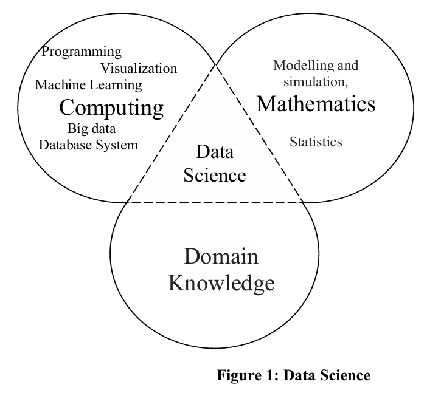

# UNIT 1  INTRODUCTION TO DATA SCIENCE

---

1.0 Introduction  

1.1 Objective  

1.2 Data Science – Definition  

1.3 Types of Data  

&nbsp;&nbsp;&nbsp;&nbsp;1.3.1 Statistical Data Types  

&nbsp;&nbsp;&nbsp;&nbsp;1.3.2 Sampling  

1.4 Basic Methods of Data Analysis  

&nbsp;&nbsp;&nbsp;&nbsp;1.4.1 Descriptive Analysis  

&nbsp;&nbsp;&nbsp;&nbsp;1.4.2 Exploratory Analysis  

&nbsp;&nbsp;&nbsp;&nbsp;1.4.3 Inferential Analysis  

&nbsp;&nbsp;&nbsp;&nbsp;1.4.4 Predictive Analysis  

1.5 Common Misconceptions of Data Analysis  

1.6 Applications of Data Science  

1.7 Data Science Life Cycle  

1.8 Summary  

1.9 Solutions / Answers  

---
## 1.0 INTRODUCTION
---

In the last ten years, the Internet and communication technology have grown very fast. Because of this growth, a huge amount of data is being created every day.

Most of this data is **unstructured**, which means it does not have a fixed format. Examples of unstructured data are:

* Text from social media posts
* Images and graphics
* Videos
* Audio files

This data is mainly generated because people use social media, smartphones, and mobile apps a lot.

Along with this, organisations are also growing digitally. Because of this digital growth, a large amount of **semi-structured data** is being created. An example of semi-structured data is **XML data**. This type of data is partly organized but not completely like tables.

In addition to unstructured and semi-structured data, organisations already have a large amount of **structured data** stored in databases and data warehouses.

All these types of data can be processed, sometimes in **real time**, to help organisations make better decisions.

**Data science** is a field that focuses on:

* Collecting data
* Combining data from different sources
* Processing large amounts of data

The main goal of data science is to produce useful information that helps in **better and informed decision making**.

This unit introduces the basic concepts of data science. It explains different types of data used in data science and the different types of analysis that can be done using data. The unit also introduces some common mistakes that people make while working with data science.

---
## 1.1 OBJECTIVES
---

At the end of this unit, you will be able to:

- Define what **data science** means in the context of an organization  
  (for example, how companies use data to support business decisions)

- Explain the **different types of data** used in data science  

- List and explain the **different types of analysis** that can be performed on data  

- Explain the **common mistakes related to data size**  
  (for example, believing that more data always gives better results)

- Define the concept of **data dredging**  
  (searching for patterns in data without a proper goal)

- List some **applications of data science**  
  (for example, healthcare, finance, and marketing)

- Define the **data science life cycle**  
  (the steps followed from collecting data to getting results)

---
## 1.2 DATA SCIENCE – DEFINITION
---

Data Science is a **multi-disciplinary field** whose main goal is to analyze data and generate useful knowledge that can help in decision making.

The knowledge produced by data science can be in different forms, such as:
- Finding similar patterns in data  
- Building predictive or planning models  
- Creating forecasting models for future outcomes  
  (for example, predicting future sales or customer demand)

A data science application collects data from **multiple heterogeneous sources**, meaning data comes from different types of sources and formats. This data is then:
- Cleaned to remove errors and unwanted data  
- Integrated to combine data from different sources  
- Processed and analyzed using various tools  

After analysis, the results are presented as **information and knowledge** using different visual forms such as charts and graphs  
(for example, dashboards used by companies to understand performance).

As mentioned earlier, data science is called a **multi-disciplinary science** because it combines knowledge from different fields, as shown in Figure 1.

## Advantages of Data Science in an Organization

Data science has many advantages in an organization. Some important areas where data science is useful are given below:

- It helps organizations make **better business decisions**, such as checking the financial health and reliability of companies before collaborating with them.

- It helps in making **better future predictions**, such as creating strategic plans for the company based on current data and trends.

- It helps identify **similar patterns in data**, which can be used in applications like fraud detection and targeted marketing.

In general, data science plays an important role in **business decision making**, especially in today’s world where data is being generated at a very large scale, measured in zettabytes.
